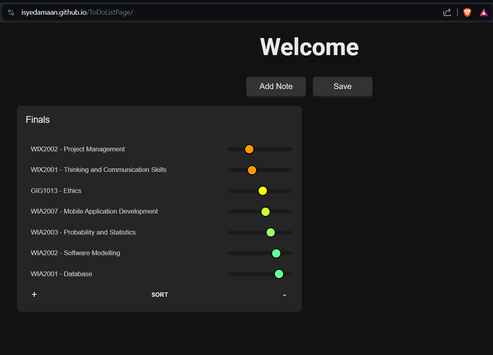

# Amaan's Tierlist Note App

A super basic To Do List web application crafted using HTML, CSS, and JavaScript, featuring the special ability to sort tasks based on confidence or urgency. This intuitive and user-friendly interface is perfect for quickly organizing tasks and priorities.

## Features

- **Add Notes:** Easily add new notes to your list with a single click.
- **Sortable Tasks:** Organize your tasks with respect to confidence or urgency, helping you to focus on what matters most.
- **Persistent Storage:** Your notes are saved locally, ensuring that your data isn't lost even when you close the browser.
- **Dynamic UI Updates:** Slider-based input for task urgency, with color-coded feedback for at-a-glance assessment.

## How to Use

1. **Add a Note:** Click on the "Add Note" button to create a new note.
2. **Enter Details:** Type in your note's title and any necessary items. Adjust their urgency using the slider.
3. **Sort Tasks:** Click the "SORT" button within a note to sort the items based on the slider values.
4. **Save Your Notes:** Click "Save" to ensure your notes are saved to your browser's local storage.

## Pictures

I used to sort my prepartion level for my courses in semester 3.

## Contributions

Contributions are welcome! If you have ideas on how to improve this application or add new features, feel free to fork the repository and submit a pull request.
